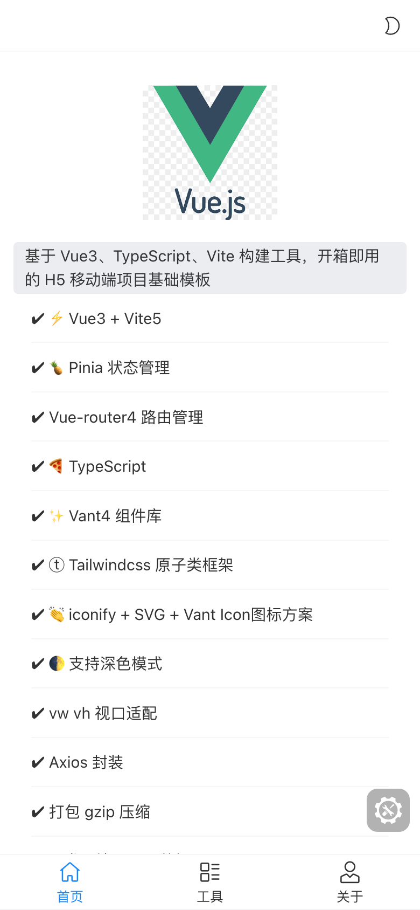
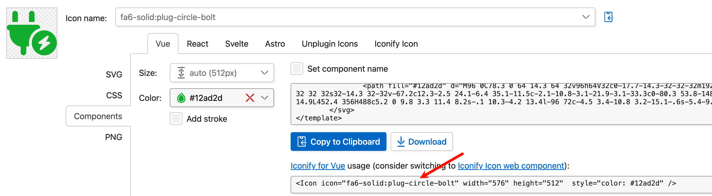
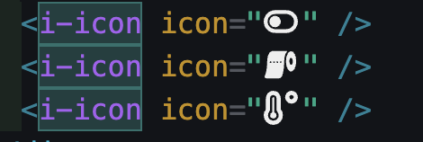
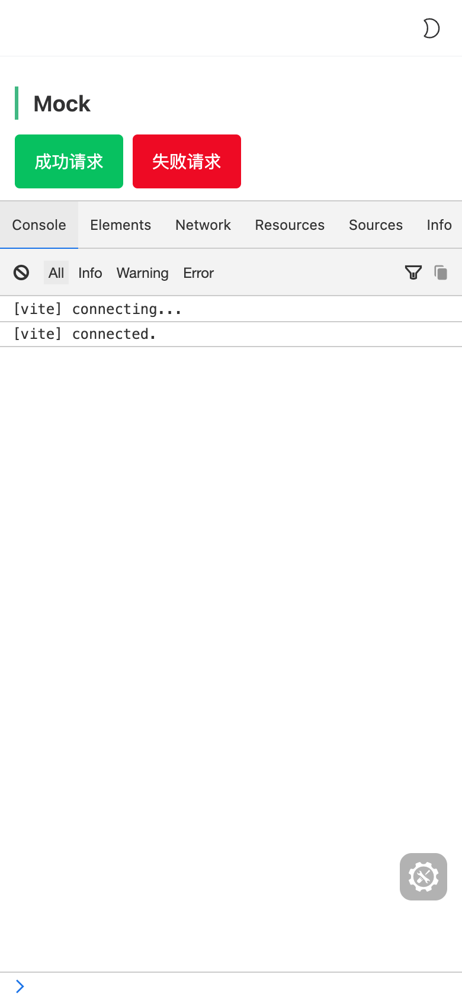

<h1 align="center">Vue3移动端模板</h1>

**基于 Vue3、TS/JS、Vite 构建工具，开箱即用的移动端项目基础模板**

- [x] Vue3 + Vite5
- [x] TypeScript
- [x] Pinia 状态管理
- [x] Vue-router 4
- [x] Axios
- [x] vw vh视口适配
- [x] Vant4 组件库
- [x] Tailwindcss
- [x] iconify + SVG + Vant Icon图标方案
- [x] ESLint
- [x] 开发环境 Mock 数据
- [x] husky + lint-staged
- [x] 打包 gzip 压缩
- [x] Vue组件自动导入 + 依赖组件导入
- [x] 首屏加载动画
- [x] 开发环境调试面板eruda
- [x] 生产环境 CDN 依赖
- [x] 深色模式
- [x] commit校验

## 运行项目

注意：要求 Node 版本 18+，可使用 [nvm](https://github.com/nvm-sh/nvm#installing-and-updating) 进行本地 Node 版本管理，建议使用 [pnpm](https://pnpm.io/zh/installation) 包管理器

```shell
# 进入项目目录
cd vue3-h5-template

# 安装依赖
pnpm install

# 启动服务
pnpm dev
```

## demo 截图



### <span id="vant">按需引入 vant 组件</span>

全量引入组件库太过臃肿，项目中使用 `unplugin-vue-components` 插件进行按需自动引入组件，可通过[官方文档](https://vant-ui.github.io/vant/#/zh-CN/quickstart#2.-pei-zhi-cha-jian)了解更多。

### <span id="icon">图标使用</span>

① **Iconify 图标（推荐）**

Iconify 拥有图标数量超过 20 万的图标库，同时文档比较友好

使用方法 ⑴：



基于 Iconify [图标集网站](https://icon-sets.iconify.design/)获取到想要的图标名称后填入 `i-icon` 组件的 `icon` 属性即可，基于 `Iconify for Vue` 稍微进行了封装

```vue
<i-icon icon="fa6-solid:heart" />
```

配合 VS Code [编辑器扩展antfu.iconify](https://marketplace.visualstudio.com/items?itemName=antfu.iconify)可在编码时实时预览图标



注意，方法 ⑴ 是通过 Iconify API 按需请求获取图标，如果项目仅在内网环境部署，可通过👇🏻方法 ⑵ 离线使用图标

使用方法 ⑵ ：

基于 Iconify [图标集网站](https://icon-sets.iconify.design/)搜索到想要的图标，安装图标对应的图标集依赖包

```shell
pnpm i -D @iconify-icons/fa6-solid
```

引入想要的图标 data，赋值给 `i-icon` 组件的 `icon` 属性即可

```ts
import Fa6SolidHeart from "@iconify-icons/fa6-solid/heart";
```

```vue
<i-icon :icon="Fa6SolidHeart" />
```

② 本地 SVG 文件图标

> 1. 将 svg 图标文件放在 `src/icons/svg` 目录下
> 2. 在项目中直接使用 `<svg-icon name="svg图标文件命名" />` 即可

> 项目使用了 `unplugin-vue-components` 自动引入组件，所以 `main.ts` 中无需注册全局图标组件

### ⚠<span id="router">路由缓存 & 命名注意</span>

组件默认开启缓存，如某个组件需关闭缓存，在对应路由 `meta` 内的 `noCache` 字段赋值为 `true` 即可

```typescript
// src/router/routes.ts
const routes: Array<RouteRecordRaw> = [
  // ...
  {
    path: "about",
    name: "About",
    component: () => import("@/views/about/index.vue"),
    meta: {
      title: "关于",
      noCache: true
    }
  }
];
```

为了保证页面能被正确缓存，确保**组件**的 `name` 值和对应路由的 `name` 命名完全相同。

```vue
<!-- src/views/about/index.vue -->
<script setup lang="ts">
defineOptions({ name: "About" });
// Vue3.3以下，使用 `vite-plugin-vue-setup-extend` 插件，可在 `setup` 语法糖标签上添加 `name` 属性为组件命名
// Vue3.3+ 可直接使用 defineOptions
</script>

<template>
  <div>about</div>
</template>
```

### <span id="console">调试面板 eruda</span>



为了方便移动端查看 log 信息和调试，开发环境引入了 eruda 调试面板的 cdn。如果开发环境不需要的话请在 `.env.development` 中修改值

### <span id="mock">开发环境 Mock</span>

> 开发环境支持 mock 请求数据，在 `mock` 目录中可配置接口和数据，具体见[文档](https://github.com/pengzhanbo/vite-plugin-mock-dev-server/blob/main/README.zh-CN.md)

### <span id="viewport">vw 视口适配</span>

使用 `postcss-px-to-viewport` 进行视口适配，相关配置见项目根目录下 `postcss.config.js`

### - <span id="tailwindcss">Tailwindcss 原子类框架</span>

Tailwindcss 从 3.0 版本开始默认使用 `JIT` 模式，打包代码不再臃肿，结合 `vite` 使用非常香~

官方文档：https://tailwindcss.com/docs/padding

### - <span id="git">Git 提交信息规范</span>

项目使用 `husky` 规范 Git 提交信息，遵循社区主流的 [Angular](https://github.com/conventional-changelog/conventional-changelog/tree/master/packages/conventional-changelog-angular) 规范。

```
feat 增加新功能
fix 修复问题/BUG
style 代码风格相关无影响运行结果的
perf 优化/性能提升
refactor 重构
revert 撤销修改
test 测试相关
docs 文档/注释
chore 依赖更新/脚手架配置修改等
workflow 工作流改进
ci 持续集成
types 类型定义文件更改
wip 开发中
```

```
// 格式
<type>(<scope>): <subject>
// 示例
feat(layout): 布局完成
```

### - <span id="CDN">CDN 生产环境依赖</span>

生产环境默认不开启 CDN 加载依赖，如需开启生产环境加载 CDN 依赖，在根目录生产环境变量文件 `.env.production` 中修改 `VITE_CDN_DEPS` 的值为 `true` 重新打包即可

### 其他问题

关于vant组件库内部的适配问题
https://blog.csdn.net/weixin_43239880/article/details/132405008

copy：
https://github.com/yulimchen/vue3-h5-template/tree/js-version
